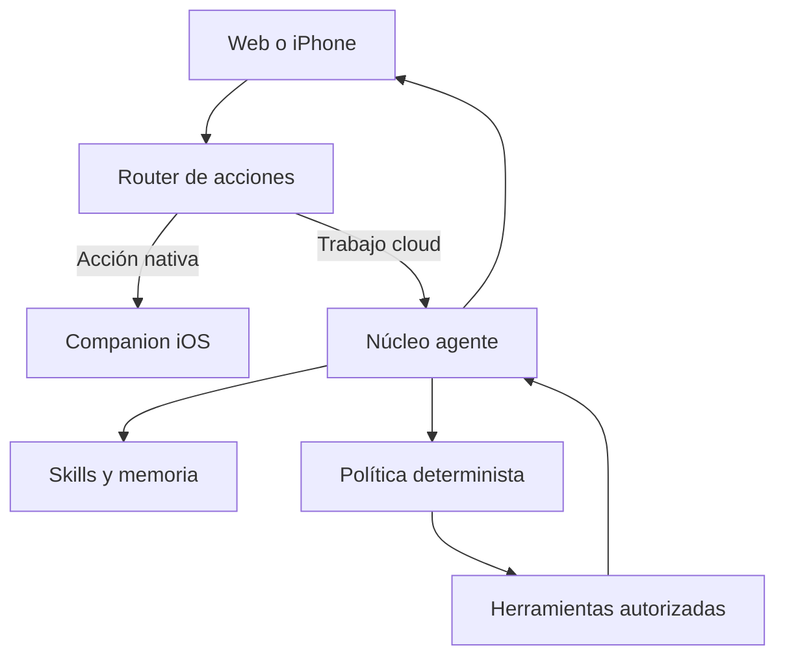

# ZYRON Agent Core v0.7

## Decisión

ZYRON evoluciona; no se reinicia. La web privada, PostgreSQL/Neon, el router multimodelo, Google, el registro de capacidades y el companion iOS son activos válidos. El cambio consiste en sustituir el chat final rígido por un núcleo agente capaz de escoger skills, usar herramientas y comprobar resultados.

## Qué se incorpora

1. **Identidad independiente del modelo.** OpenAI, Claude o Gemini actúan como motores intercambiables.
2. **Skills activadas por contexto.** Identidad, seguridad y memoria están siempre activas; tareas, calendario y dispositivo se cargan cuando son relevantes.
3. **Bucle de herramientas acotado.** El agente puede encadenar hasta cuatro pasos por defecto y nunca continuar indefinidamente.
4. **Política determinista.** El modelo propone llamadas, pero el código decide si están autorizadas.
5. **Resultados verificables.** ZYRON solo puede afirmar éxito cuando la herramienta devuelve `ok: true`.
6. **Memoria protegida.** La memoria permanente solo se escribe ante una petición explícita de Aarón.
7. **Auditoría.** Las acciones del agente se registran en `zyron_actions` sin guardar secretos.

## Herramientas v0.7

| Herramienta | Efecto | Política |
|---|---|---|
| `list_tasks` | Lectura | Directa |
| `create_task` | Escritura reversible | Directa |
| `complete_task` | Escritura reversible | Directa; exige coincidencia única |
| `build_daily_plan` | Lectura | Directa |
| `search_memory` | Lectura privada | Solo sesión de propietario |
| `remember_fact` | Escritura persistente | Solo petición explícita |
| `read_calendar` | Lectura privada | Solo sesión de propietario |

No se exponen borrado, envío de mensajes, pagos, cambios de permisos ni ejecución arbitraria de código. Esas capacidades se añadirán una por una, con ejecutor aislado y confirmación cuando corresponda.

## Flujo

## Relación con proyectos similares

El diseño toma el patrón de gateway multicanal de OpenClaw, el aislamiento y la sencillez de NanoClaw y el enfoque de memoria persistente de Letta, pero conserva ZYRON como producto propio. No se instala un agente externo con acceso total a la vida digital del propietario.

## Siguientes incrementos

1. Añadir un canal remoto —Telegram primero para validar; WhatsApp después— conectado al mismo endpoint autenticado.
2. Ejecutar herramientas de alto riesgo en un worker/contenedor aislado, no en el proceso web.
3. Incorporar un almacén de trabajos duraderos para procesos que sobrevivan a reinicios y límites serverless.
4. Añadir confirmaciones transaccionales reutilizables para borrar, enviar o modificar datos.
5. Recuperar y consolidar memoria episódica sin guardar conversaciones completas de forma indiscriminada.
6. Mantener el companion iOS como puente para voz, permisos, notificaciones y acciones del teléfono.

## Configuración

`ZYRON_AGENT_MAX_STEPS` permite fijar de 1 a 6 pasos. El valor por defecto es 4. Los proveedores y la base de datos mantienen las variables ya existentes.

## Criterios de aceptación

- Una petición conversacional responde con identidad ZYRON aunque cambie el proveedor.
- «Apunta comprar…» crea una tarea y la respuesta refleja el resultado real.
- «He terminado…» solo completa una coincidencia única.
- Una consulta de agenda utiliza datos reales de Calendar.
- «Recuerda que…» guarda memoria; una conversación ordinaria no lo hace.
- Ninguna herramienta puede borrar, enviar mensajes o ejecutar comandos.
- El endpoint requiere la sesión privada existente mediante `proxy.ts`.
